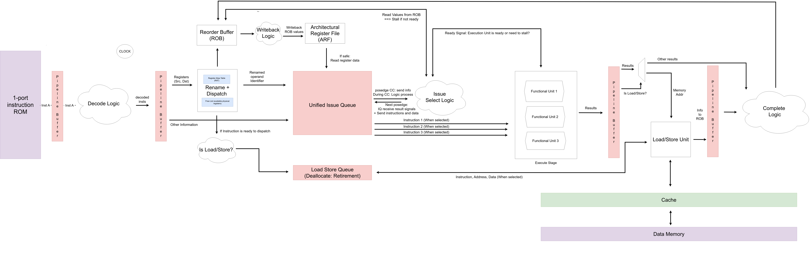

# RISC-V Out-of-Order Processor
This repository contains an RTL implementation of a 3-issue out-of-order (OoO) RISC-V processor in Verilog. 

## Microarchitecture 
Our design was based on the microarchitecture below: 



## Supported Instructions
Our Processor Supports the Following 32-bit instructions: 
```
R-type: ADD, XOR
I-type: ADDI, LUI, ORI, SRAI
Memory: LB, LW, SB, SW
```
NOTE: This version does not support branch and jump instructions. 

## Building and Testing 
To test our processor locally, clone our repository: 
```
git clone https://github.com/visyat/RISCV-OoO-CPU.git
```
Import all files `/src/*.v,` `/sim/tb.v`, and `/sim/evaluation-hex.txt` into your Verilog simulator: Modelsim/Questasim (with Quartus) or Xilinx Vivado. Our test bench runs our top-level `CPU` module, loading the following instructions represented in byte-code (little-endian) from `evaluation-hex.txt` into our `Instruction Memory`: 

```
addi x1, x0, 4
addi x2, x0, 6
add x3, x2, x1
lui x4, 1
sw x3, 4(x0)
sw x4, 4(x1)
lw x2, 4(x0)
lw x5, 8(x0)
xor x5, x5, x1
ori x6, x0, 4
sb x6,12(x0)
addi x7, x6, 1
lb x7, 12(x0)
add x7, x7, x6
addi x2, x0, 11
lui x3, 6
add x10, x7, x0
add x11, x3, x5

# a0=8, a1=28676
```
Feel free to load your own instructions into `evaluation-hex.txt` for testing or substitute another bytecode file in `/src/IMFetch.v`. 

## Components and Specifications
1. **Instruction Read-Only Memory (ROM)**: One instruction fetch per cycle
2. Decode Logic & Rename
3. **Reorder Buffer (ROB)**: 64 values, 2 retires per cycle
4. Architectural Register File (ARF): 32 registers (32-bit each)
5. **Unified Issue Queue/Reservation Station**: 64 instructions, 3 issue ports
6. Functional Units/ALU
7. **Load-Store Queue (LSQ)**: 16 instructions
8. Data Memory: 10-cycle read/write latency
9. **4-way Set-Associative Cache**: 32KB size, random eviction, write-through policy, 1-cycle read latency
10. Complete and Retirement Logic
11. Pipeline Registers: Fetch (IF), Decode (ID), Execution (EX), Memory (MEM), Complete/Retire (C) Stages

## Authors 
This processor was made as a project for ECE M116C/CS M151B: Computer Architecture Systems (Fall 2024), taught by Professor Nader Sehatbakhsh. It was built by Vishal Yathish and Paige Larson.
